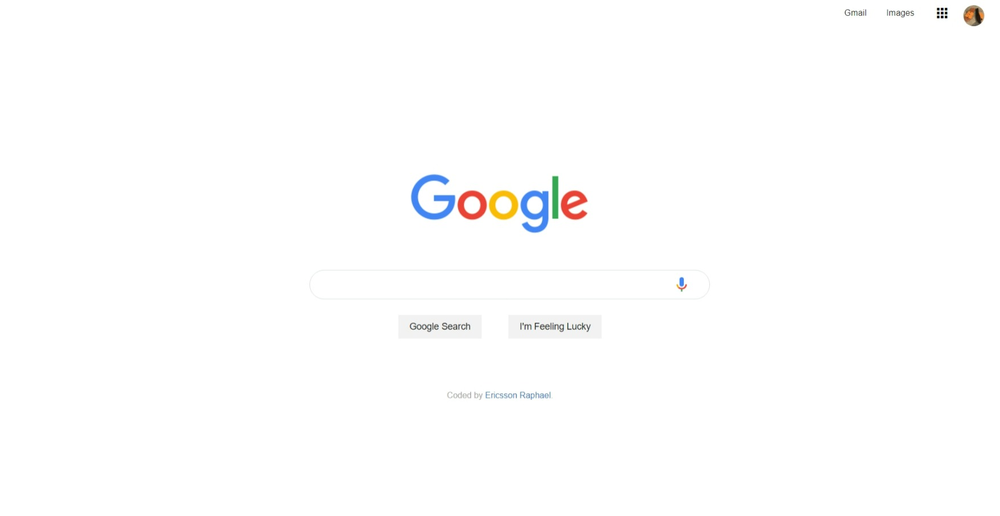

# EdYoda - Google Homepage

## Table of contents

- [Overview](#overview)
  - [About](#about)
  - [The Challenge](#the-challenge)
  - [Updates](#updates)
  - [Screenshots](#screenshots)
  - [Links](#links)
- [My process](#my-process)
  - [Built with](#built-with)
- [Author](#author)
- [Acknowledgments](#acknowledgments)

## Overview

### About

Responsive website using HTML/HTML5 and CSS/CSS3

### The Challenge

My goal was to recreate EdYoda's Google Homepage Website

### Updates

- Responsive Web Design across all Devices

### Screenshot

### Links

- Code URL: [Github Repo here](https://github.com/gitEricsson/Google-Homepage)
- Live Site URL: [Live site here](https://ericsson-google-homepage.netlify.app/)

## My process

### Built with

- Semantic HTML5 markup
- CSS custom properties
- Flexbox
- CSS Grid

## Author

- Website - [Ericsson Raphael](https://github.com/gitEricsson)
- LinkedIn - [@ericsson](www.linkedin.com/in/ericssonraphael)
- Gmail - [@ericsson](ericssonraphael@gmail.com)

## Acknowledgments

[EdYoda](https://github.com/edyoda)
